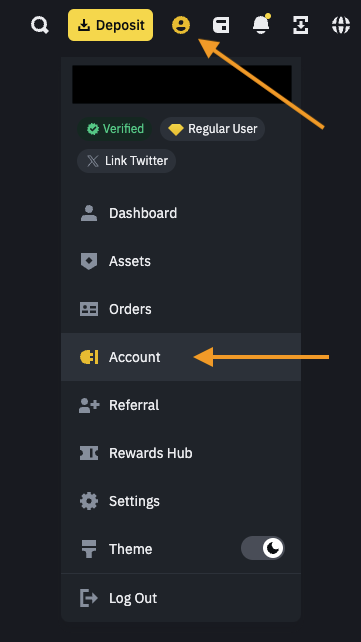
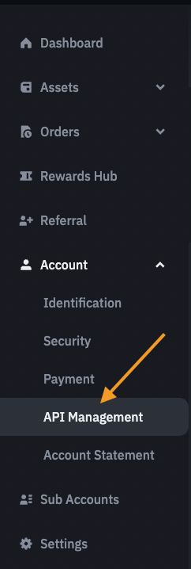

# Creating a Binance API Key

On your Account page, on the left side, click on **API Management:**






Click the **"Create API"** button and then once the key is created, click **"Edit Restrictions"**.

Please ensure: 

- The key has checked **"Enable Spot & Margin Trading"**

- The key has checked **"Enable Futures"**

- The key does **not** have withdrawal access for your security

:::info 

We have enabled Spot-Only API keys for those users who can't enable Futures for their API keys due to their regional restrictions. You simply need to enable only "Spot & Margin Trading"

:::

If you can't edit those, you will have to uncheck the **"Default Security Controls"**, which you find above.

### IP Access Restrictions

For better key security, we recommend you select **"Restrict access to trusted IPs only"** and whitelist our server IPs. Hover over the box below and press the 'copy' button on the right to copy the text.

```ts
45.32.51.91 202.182.118.247 149.28.26.187 108.61.181.242 66.42.35.121 167.179.113.62 108.61.201.196 45.32.15.26 45.32.46.51 66.42.32.45 45.32.21.44 45.32.248.74 167.179.72.59 45.76.215.92 198.13.32.237 108.160.143.252 167.179.71.160 139.180.206.70 45.32.56.13 45.76.96.149 66.42.40.230 167.179.116.54 45.76.212.66 45.76.105.105 66.42.43.7 45.76.215.145 45.32.22.39 167.179.91.213 149.28.18.241 139.180.204.250 202.182.97.74 139.180.205.136 202.182.106.58 108.61.163.146 45.77.179.79
```

:::info 

It's important you copy and paste **all** of the IPs. There are 35 in total.

:::

Now on Binance after selecting the **"Restrict.. "** option, paste the above IP list text into the box provided  and click on Confirm.

Click Save and add your key to the Terminal API Key input form. Note you may also use the Terminal in **Unrestricted** mode.

```
