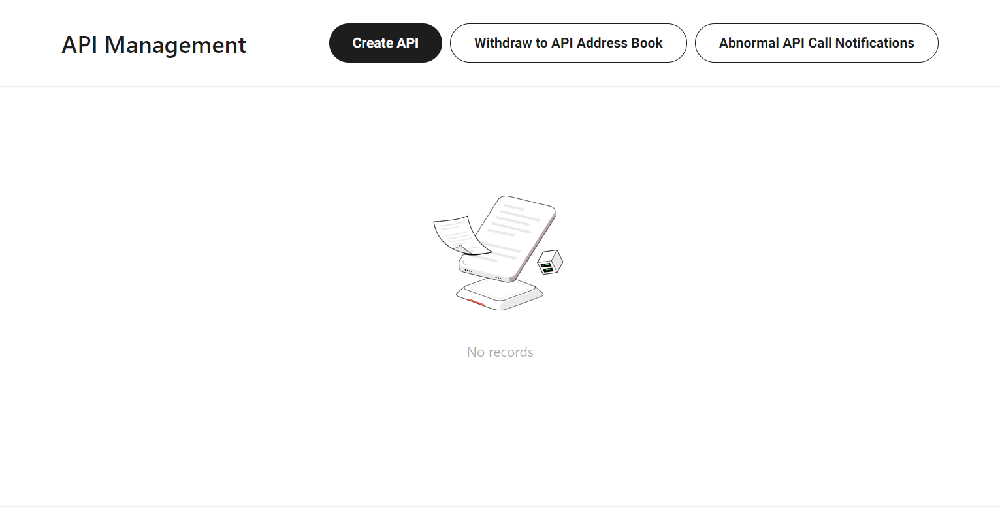
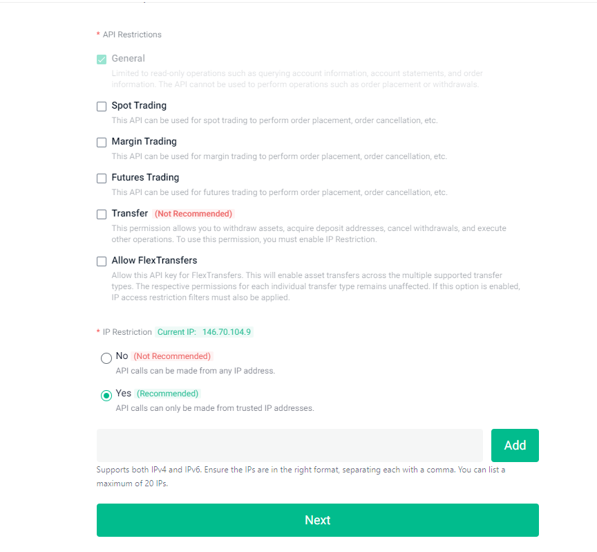
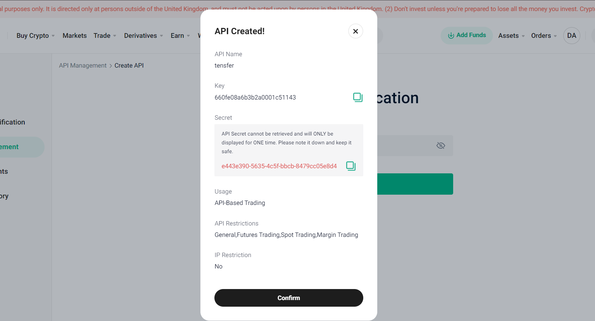

# Creating a Kucoin API Key

Login to your account on **Kucoin.com**,  navigate to the **API Management** section of your account and click the **Create API** button.



KuCoin usually allows you to set API restrictions for your API key, such as whether it can access Spot trading, Margin trading, and so on.

:::info Optional : Add IP Whitelisting

Some exchanges, including KuCoin, allow you to whitelist specific IP addresses for added security. If you choose to use this feature, you'll need to add your IP address(es) to ensure your API key can only be used from those locations.

:::




Click **Next**. If you have 2fa enabled, you will be asked to input your trading password, an OTP would be sent to your registered email and you will have to provide your Google Authenticator code. You can now copy the generated key and secret.



```
