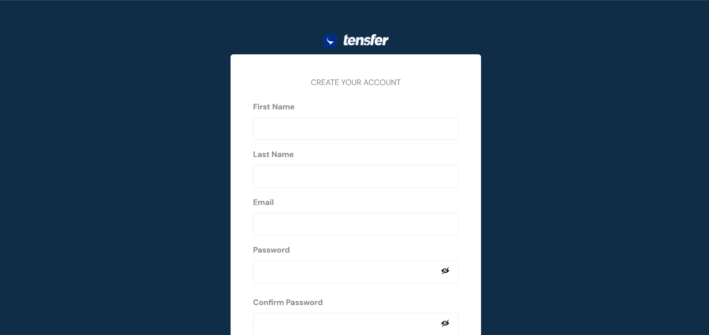

# Test your app!

Test the app you create to check out Tensfer's features, and to demo the whole user journey.

## Request access to API Keys

Contact <a href='#' className='link' target='blank'>support</a> to request for test and live credentials:

## Get test credentials

Click on an App in the Dashboard to retrieve your sandbox credentials.

- The client token is a unique ID that represents you, as a client. You must use it together with your public API key in your Tensfer app implementation. Client tokens can be used in both Sandbox and Production environments.

- The public API key, along with the client token is used to authenticate your Tensfer app implementation.

- The secret API key is a JWT bearer token that you must use for authentication on the API level.

## Set up the environment

During your integration phase, set up the sandbox environment in these interfaces: the API, your Tensfer apps, and the dashboard.

### In the embed options

Set the value of `env` to `production-sandbox` when you build with `options`. Learn more about the options that you can use when you <a href='embed-your-app#using-buildwithshorturl' className='link'>embed your app</a>.

### In the Dashboard

Select an App in the Apps menu and select `Sandbox` mode in the top right.

## Interact with the API

:::info

Make sure that you read through the <a href='/' className='link'>Tensfer API overview</a> to understand the specifics of interacting with the Tensfer API, like request and response formats, pagination, and rate limiting.

:::

1. Select your Tensfer Sandbox environment.

2. In the Tensfer API Reference collection, select Wallets → <a href='/' className='link'>Get list of wallets.</a>

3. Click send and check the response.

If you set everything up correctly, this endpoint operation returns a list of banks that Tensfer supports.

## Create a test customer

To test how your customer will go through the account connection flow, you need to create a test customer. You can do this in multiple ways:

- You can create a customer on the Dashboard. You have the option to manually fill out customer details and define the login credentials, which are needed to go through the account connection flow. You also have the option to autogenerate a customer.

- You can also create a customer via the API. You can define customer details manually in your request using the Create customer endpoint operation, and you can leverage the Autogenerate endpoint via the API as well.

:::info

When you create customers, the account type you select determines the data set that the API generates. For example, the API only generates BVN and NUBAN values for customers with Personal accounts.

:::

## Embed the Tensfer app

Let's see how you can link a bank account using the sandbox environment, and with test credentials:

