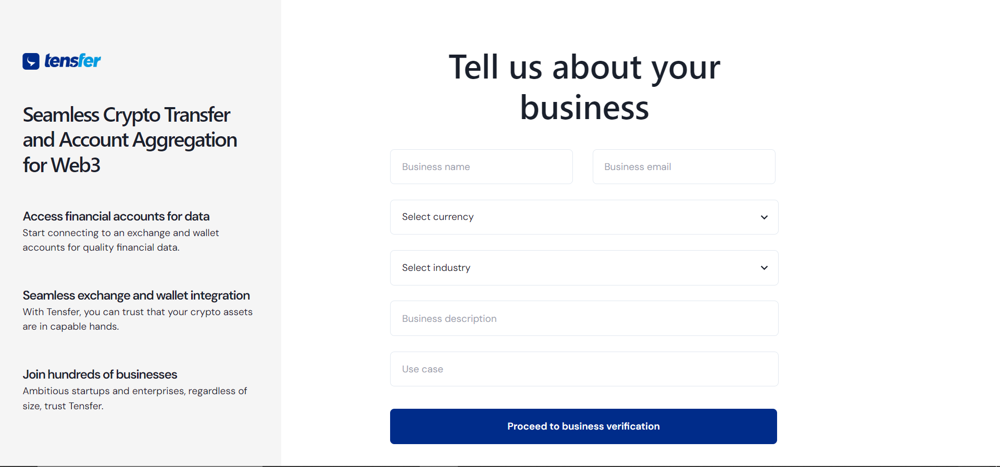
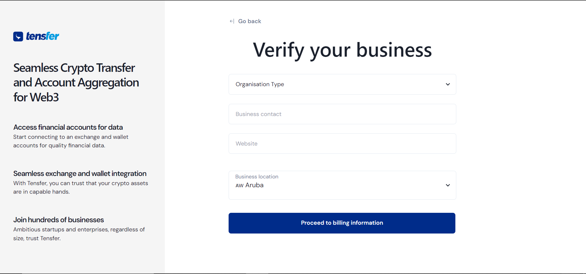
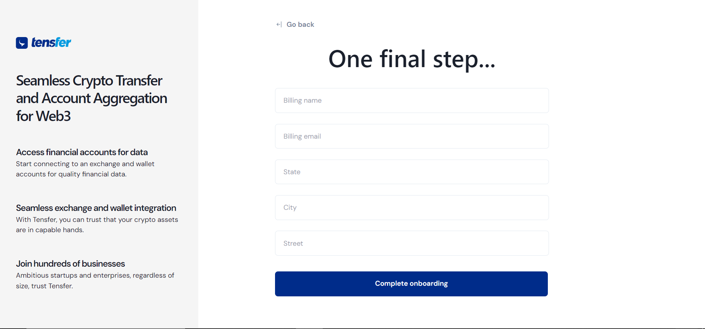

# Onboarding

Building the impossible with Tensfer begins with your onboarding. This guide takes you through the necessary steps to get you started with using Tensfer's services.

### Complete compliance

After you’ve verified your email address, you can start signing up your business via the Tensfer Dashboard. This compliance process has 3 steps:

- 
Company info
 Provide your company name, the industry of of your business it's use case.

- 
Business profile
  Creating this business profile helps Tensfer provide more accurate support in case you need help.

- 
Business profile
  The last step is to provide your billing information so you can top your wallet and access the most out of Tensfer's products.

