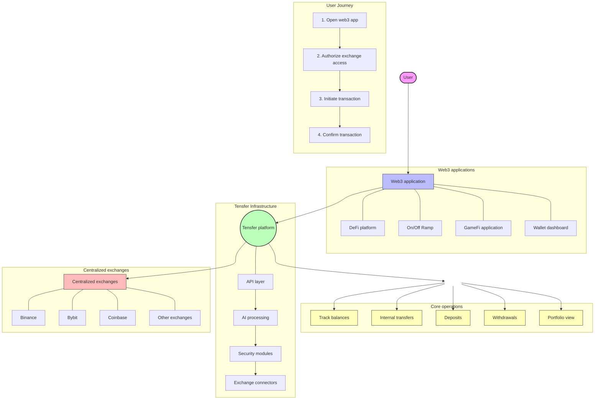

# Overview

**The AI powered crypto interoperable infrastructure for businesses and users**

Tensfer is an innovative, AI-driven, interoperable connectivity tool that streamlines the integration of centralized exchange (CEX) features, including balance tracking, internal transfers, deposits, and withdrawals. Supporting over 15 exchanges, it seamlessly manages all your CEX asset management needs—whether for internal use or to enhance your products.

Tensfer is designed not only for users who want to track, trade, or view their portfolios across multiple exchanges, but also for businesses building innovative web3 products that need to enable their users to move liquidity seamlessly from CEXs directly into their applications. Think of Tensfer as the middleman that connects all centralized exchanges and embeds their functionality into your apps, allowing your users to link their favorite exchange and perform transactions—such as making a deposit from Binance or withdrawing from Bybit—without leaving the app or worrying about copying and pasting lengthy crypto addresses.

## The problem

Tensfer is designed to solve the fragmentation and clunky user experience inherent in managing and transferring digital assets across multiple centralized exchanges (CEXs) and web3 applications.

### Fragmented ecosystem

In today’s crypto space, liquidity is scattered across various centralized exchanges. This fragmentation forces both retail users and businesses to deal with isolated silos of liquidity. Institutional or retail investors who want to monitor their portfolios, execute trades, or engage in arbitrage must manually jump between different platforms. This results in a disjointed experience, where continuity and efficiency are sacrificed for the sake of accessing multiple markets.

### Inefficient user interactions

For users, especially those managing significant portfolios or seeking active trading opportunities, transferring assets between platforms is cumbersome. They have to log in to separate exchange interfaces, manually initiate deposits or withdrawals, and often contend with tedious steps like copying and pasting long crypto addresses. This not only slows down the trading or investment processes but also introduces potential for errors and security risks—mistyped addresses or misdirected funds.

## The solution: Bridging the gap for businesses and individuals

### Seamless Integration into web3 products

Beyond serving individual investors, Tensfer is designed with businesses in mind. Many innovative web3 applications currently face a technical challenge: how to enable users to move liquidity effortlessly from CEXs into their apps without forcing them out of the native app environment. Traditional integrations require users to leave the app, perform separate transactions on an exchange, and then return to the application, breaking the flow and often discouraging continued engagement.

### Tensfer as the middleman

Tensfer positions itself as the essential “middleman” that bridges this gap. By aggregating and connecting liquidity from various centralized exchanges directly into business applications, Tensfer allows for:

- **Streamlined deposits and withdrawals:**  
  Users can effortlessly transfer funds—such as moving assets from Binance or Bybit and many other major exchanges—without ever leaving the app interface. This seamless integration eliminates the need for manual copying and pasting of lengthy crypto addresses and reduces the friction associated with manual processes.

- **Enhanced user experience:**  
  By embedding exchange functionalities directly into apps, businesses can offer a smooth, continuous in-app experience that not only reduces operational risks but also increases user satisfaction and retention.

- **Operational efficiency:**  
  For developers, this means they do not have to build and maintain complex integrations with multiple exchanges. Instead, they can rely on Tensfer’s robust infrastructure, allowing them to focus on innovating and scaling other aspects of their products.
