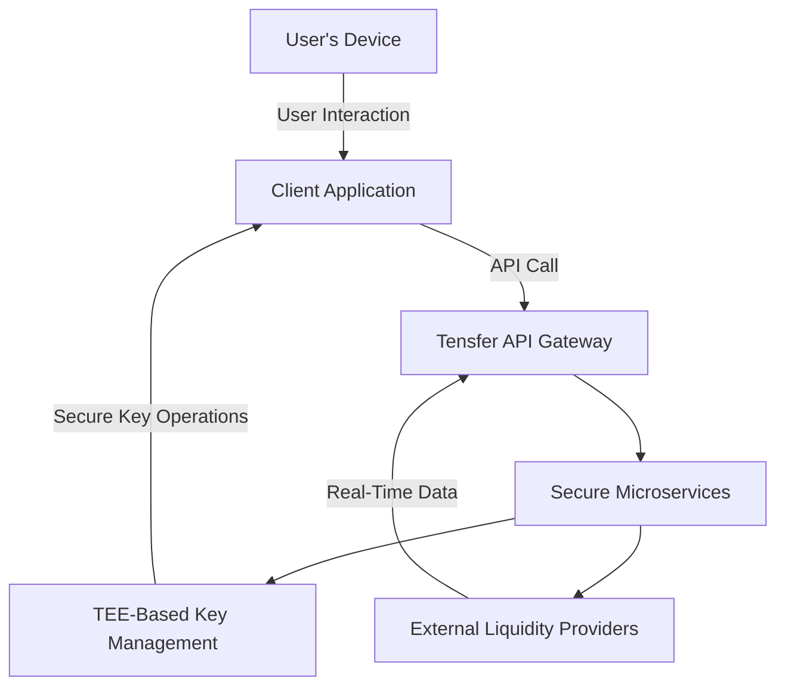
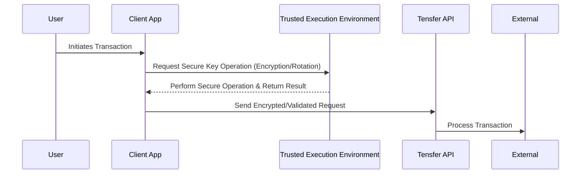

# Security

Tensfer is a non-custodial, interoperable infrastructure designed with security as a cornerstone. Our system is built on a zero-trust model, leverages a trusted execution environment (TEE) for secure key management/rotation, and ensures that user keys are never stored on our servers. This unique security approach distinguishes Tensfer from competitors and aligns with the highest standards of digital asset and data protection.

---

## Security principles

At Tensfer, security is engineered from the ground up. Our approach is underpinned by the following principles:

- **Zero trust architecture:**  
  No entity, whether inside or outside the network, is inherently trusted. Every request for access is rigorously authenticated, authorized, and encrypted.

- **Non-custodial model:**  
  Tensfer never stores users' private keys. Instead, key management and rotation are securely handled within a TEE, ensuring that sensitive information remains under the control of the user at all times.

- **Industry-leading compliance:**  
  Our platform adheres to global security standards and best practices, including SOC II Type II compliance, ensuring that operational security, reliability, and data integrity are maintained.

- **Secure integration and interoperability:**  
  Tensfer connects seamlessly with hundreds of exchanges, wallets, and payment providers while maintaining stringent security protocols across all integration points.

---

## Architecture overview

Tensfer’s security architecture combines robust infrastructure with state-of-the-art hardware-based security to protect digital assets and user data. The following diagram illustrates the high-level architecture of Tensfer's secure ecosystem:

In this diagram:

- Client application: Represents Tensfer’s frontend interface.

- Tensfer API gateway: Serves as the first point of contact, ensuring that every request is authenticated.

- Secure microservices: Host critical functions while following strict access policies.

- TEE-Based key management: Handles sensitive key operations such as encryption, decryption, and rotation—without ever exposing user keys.

- External liquidity providers: Represent connected exchanges, wallets, and other financial services.

## User key management with TEE

A key differentiator for Tensfer is our use of a Trusted Execution Environment (TEE) for user key management. The TEE offers a secure area within the main processor to run code in an isolated environment, safeguarding keys from unauthorized access.

### Key management & rotation flow

## Key points:

- Non-Custodial Approach: At no point are user keys stored on Tensfer’s servers. All sensitive operations occur within the TEE.

- Secure Rotation: The TEE handles key rotation and cryptographic operations internally, ensuring keys are both secure and current.

- Tamper-Proof Environment: The hardware-backed TEE prevents unauthorized modifications or access, even if the host system is compromised.

## Additional security measures

In addition to our robust architecture and TEE key management, Tensfer’s security framework includes:

- End-to-End Encryption: All data in transit is protected using state-of-the-art encryption protocols.

- Multi-factor authentication (MFA): Tensfer portfolio web app and business dashboard requires businesses and users respectively to secure their account.

- Continuous auditing and monitoring: Our systems are continuously monitored, and regular audits are performed to ensure compliance with evolving security standards.

- Security-first development: Our engineering team, with decades of expertise in zero knowledge proofs, authentication and identity management, follows rigorous secure development practices for every component of the platform.

